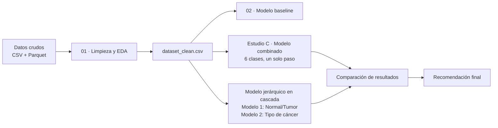

# OncoSeq — Clasificación de Cáncer a partir de Expresión Génica (TCGA)

Proyecto de clasificación de muestras de expresión génica (RNA-seq, estilo
TCGA pan-cáncer) para predecir **(a)** si una muestra es tumoral o de tejido
sano y **(b)** el tipo de cáncer entre 5 cohortes: `BRCA`, `COAD`, `KIRC`,
`LUAD` y `PRAD`.

Se comparan dos estrategias de modelado: un **clasificador combinado de 6
clases** en un solo paso y un **modelo jerárquico en cascada** de dos
etapas, evaluando cuál generaliza mejor y por qué.

---

## Tabla de contenidos

- [Dataset](#dataset)
- [Estructura del repositorio](#estructura-del-repositorio)
- [Pipeline del proyecto](#pipeline-del-proyecto)
- [Decisiones de diseño clave](#decisiones-de-diseño-clave)
- [Resultados](#resultados)
- [Cómo ejecutar](#cómo-ejecutar)
- [Requisitos](#requisitos)
- [Próximos pasos](#próximos-pasos)

---

## Dataset

| Archivo | Descripción |
|---|---|
| `oncoseq_metadatos.csv` | Metadatos por muestra: `index` (barcode), `participante` (paciente), `tipo` (`tumor`/`normal`), `cohorte` (tipo de cáncer). |
| `oncoseq_expresion.parquet` | Matriz de expresión génica cruda (muestras × genes). |
| `dataset_clean.csv` | Dataset limpio y fusionado, salida de la fase de EDA: **1680 muestras × 20531 genes** + `participante`, `tipo`, `cohorte`. Sin nulos, sin genes de varianza cero. |
| `OncoSeq_Top50_Genes_Variables.xlsx` | Ranking de los 50 genes con mayor varianza (log2), generado en el EDA. |

**Distribución de clases:**

| Cohorte | Normal | Tumor |
|---|---|---|
| BRCA | 112 | 448 |
| COAD | 41 | 164 |
| KIRC | 72 | 288 |
| LUAD | 59 | 236 |
| PRAD | 52 | 208 |

**Nota importante:** 320 de los 1680 `participante` están duplicados —
corresponden a pacientes con muestra pareada tumor/normal. Esto se tiene en
cuenta en todos los splits y validaciones cruzadas del proyecto (ver
[Decisiones de diseño](#decisiones-de-diseño-clave)).

---

## Estructura del repositorio

```
├── data/
│   ├── oncoseq_metadatos.csv
│   ├── oncoseq_expresion.parquet
│   └── dataset_clean.csv
├── reports/
│   └── OncoSeq_Top50_Genes_Variables.xlsx
├── notebooks/
│   ├── 01_exploring_eda.ipynb                       # Limpieza + EDA
│   ├── 02_modeling.ipynb                            # Primer modelo baseline
│   ├── estudio_C_modelo_combinado.ipynb              # Modelo combinado (6 clases)
│   └── modelo_jerarquico_cascada_corregido.ipynb     # Modelo en cascada (2 etapas)
├── outputs_estudio_c_cascada/                        # Métricas, gráficos y modelos (.joblib) del modelo en cascada
└── README.md
```

---

## Pipeline del proyecto



1. **`01_exploring_eda.ipynb`** — Limpieza (nulos, varianza cero, duplicados),
   detección de outliers, análisis de expresión diferencial por cohorte
   (volcano plots), ranking de genes por varianza.
2. **`02_modeling.ipynb`** — Primer pipeline de modelado (baseline):
   split agrupado por paciente, `log2 → StandardScaler → PCA → clasificador`.
3. **`estudio_C_modelo_combinado.ipynb`** — Clasificador único de 6 clases
   (`NORMAL`, `BRCA`, `COAD`, `KIRC`, `LUAD`, `PRAD`).
4. **`modelo_jerarquico_cascada_corregido.ipynb`** — Dos modelos encadenados:
   Modelo 1 (`NORMAL` vs `TUMOR`) → Modelo 2 (tipo de cáncer, solo si es tumor).

---

## Decisiones de diseño clave

- **Split agrupado por paciente, no por muestra.** Con 320 `participante`
  duplicados, un split aleatorio filtraría información entre train y test.
  Todos los splits usan `StratifiedGroupKFold` / `GroupShuffleSplit` con
  `groups=participante`, verificando siempre que no haya pacientes
  compartidos entre train y test.
- **Reducción de dimensionalidad dentro del pipeline.** Con ~20 500 genes y
  ~1680 muestras (n ≪ p), la selección de features (`SelectKBest` / `PCA`)
  vive dentro de un `Pipeline` de scikit-learn, ajustándose solo con datos
  de entrenamiento en cada fold — evita fugas de información.
- **`class_weight="balanced"`** en todos los clasificadores por el
  desbalance entre cohortes (BRCA 560 vs COAD 205 muestras).
- **Evaluación end-to-end de la cascada.** El modelo en cascada se evalúa
  encadenando Modelo 1 → Modelo 2 sobre el mismo hold-out del modelo
  combinado, para que ambas cifras sean directamente comparables.

---

## Resultados

| Enfoque | F1-macro (hold-out) | Balanced Accuracy |
|---|---|---|
| Modelo combinado (6 clases, un paso) | 0.979 | 0.977 |
| Modelo en cascada (end-to-end) | 0.980 | 0.979 |

**Conclusión:** ambos enfoques son estadísticamente equivalentes. El error
de la cascada está acotado por su etapa más débil (Modelo 1, `NORMAL` vs
`TUMOR`), que resulta ser el mismo cuello de botella biológico que domina
los errores del modelo combinado. Se validó mediante test de permutación de
etiquetas (colapso a rendimiento de azar) que la precisión obtenida **no**
se debe a fuga de datos, sino a que la señal de tejido de origen es
altamente separable — algo ya documentado en la literatura de estudios
pan-cáncer de TCGA.

Dado que la cascada no aporta ventaja de precisión medible y añade
complejidad operativa (dos modelos en vez de uno), se recomienda el
**modelo combinado** como entregable principal, salvo necesidad explícita
de negocio de un paso intermedio de cribado NORMAL/TUMOR.

---

## Cómo ejecutar

```bash
# 1. Clonar el repositorio
git clone <url-del-repo>
cd oncoseq

# 2. Crear entorno e instalar dependencias
pip install -r requirements.txt

# 3. Ejecutar los notebooks en orden
jupyter notebook notebooks/01_exploring_eda.ipynb
jupyter notebook notebooks/estudio_C_modelo_combinado.ipynb
jupyter notebook notebooks/modelo_jerarquico_cascada_corregido.ipynb
```

Ajusta la variable `DATA_PATH` al inicio de cada notebook si tus datos no
están en `data/`.

---

## Requisitos

- Python ≥ 3.10
- pandas, numpy, scikit-learn
- matplotlib, seaborn
- joblib
- openpyxl (para leer/escribir el `.xlsx` de genes)
- pyarrow o fastparquet (para leer `oncoseq_expresion.parquet`)

```
pandas
numpy
scikit-learn
matplotlib
seaborn
joblib
openpyxl
pyarrow
```

---

## Próximos pasos

- Validación externa con una cohorte TCGA no vista.
- Probar Gradient Boosting (`xgboost` / `lightgbm`) como alternativa a
  Random Forest / HistGradientBoosting.
- Evaluar si un subconjunto reducido de genes (top variables o genes
  significativos del análisis diferencial) da resultados comparables a usar
  los ~20 500 genes + selección automática — modelo más simple e
  interpretable.
- Empaquetar el modelo elegido para inferencia (API o script batch).

---

## Licencia

Pendiente de definir.
